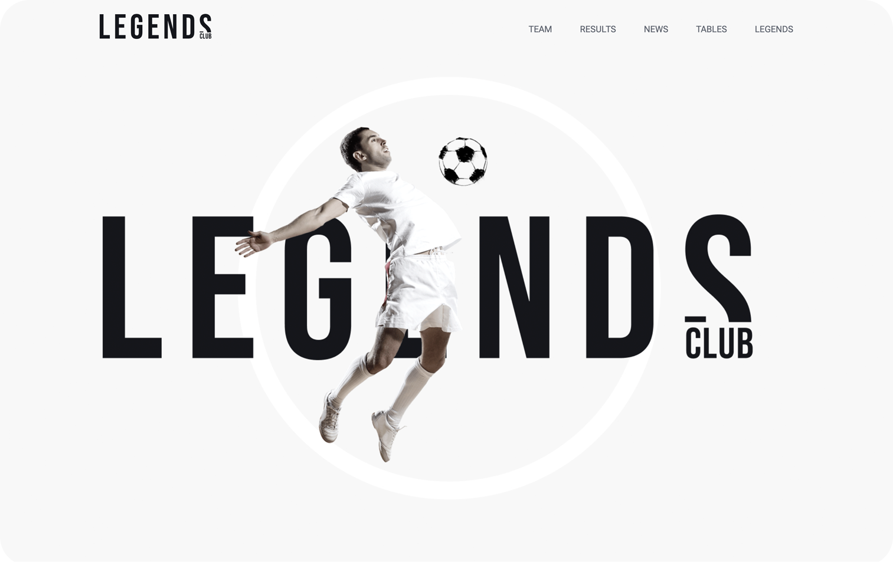
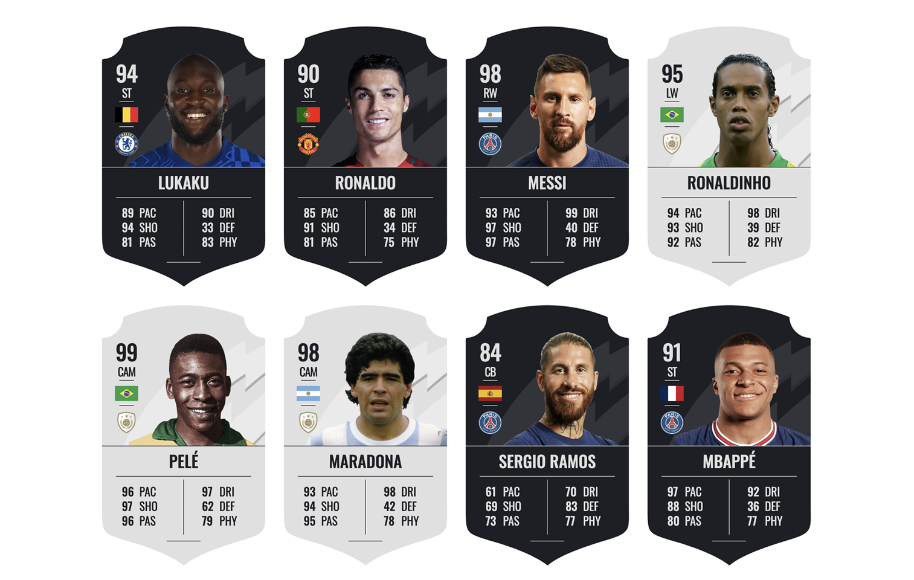
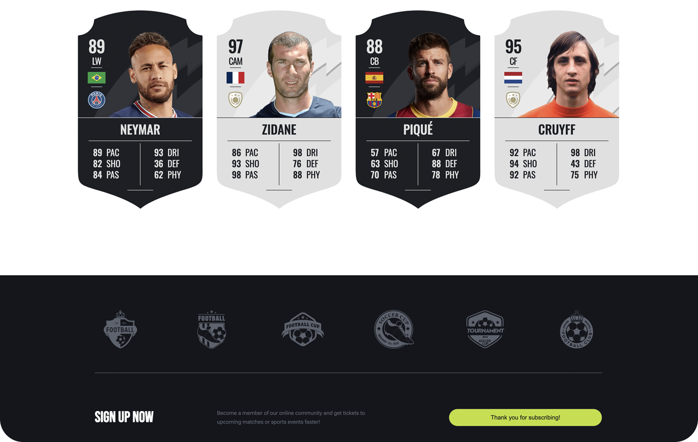

# FIFA cards[Legends Club]

## Description

Legends Clubs is a web application that showcases FIFA cards of football players. The data for the players has been extracted from a data.json file. The design for the cards was created using Figma, Photoshop, and Illustrator. The web app allows users to explore the statistics and details of different football players in a fun and interactive way.

## Live Demo

You can experience Legends Clubs and explore the FIFA cards by visiting the live demo [Live Demo](https://codenaud.github.io/fifa-cards/)

## Features

- Interactive FIFA cards displaying player statistics and details.
- Different card styles for legend players, distinguished by the "Silver" class.
- User-friendly interface for easy navigation and exploration of player data.

## Technologies Used

Legends Clubs has been developed using the following technologies:

- HTML: For the overall structure and content of the web pages.
- CSS: To style the FIFA cards and create an appealing user interface.
- JavaScript Vanilla: To handle interactivity and dynamic content.
- Fragment and Template: To efficiently manipulate the DOM and display player cards.
- Figma, Photoshop, and Illustrator: For designing the layout and visuals.

## Badges/Shields

Dev Skills

Design Skills

Build with

## Acknowledgments

This project wouldn't have been possible without the amazing community of developers and designers who continuously inspire and support one another.

In order to make this application I have needed the use of several resources.

---

    - FIFA Card [Codepen]
    - Web: [URL](https://codepen.io/codesuey/pen/gZzwBJ)

    --> FIFA 2019 FUT Ultimate Team Player Card

---

    - FIFA Card [Figma]
    - Web: [URL](https://www.figma.com/community/file/1050434895100233146/FIFA-Player-Rating-Template)

    --> FIFA Player Rating Template

---

## About Me

I'm a junior frontend developer passionate about HTML, CSS and JavaScript, who wants to share the work of all the people who have helped me on the way to being able to dedicate myself to what I like the most.

## Contact

If you have any questions or suggestions, do not hesitate to contact me through my email: [codenaud@gmail.com](mailto:codenaud@gmail.com)

Happy coding! 🚀
